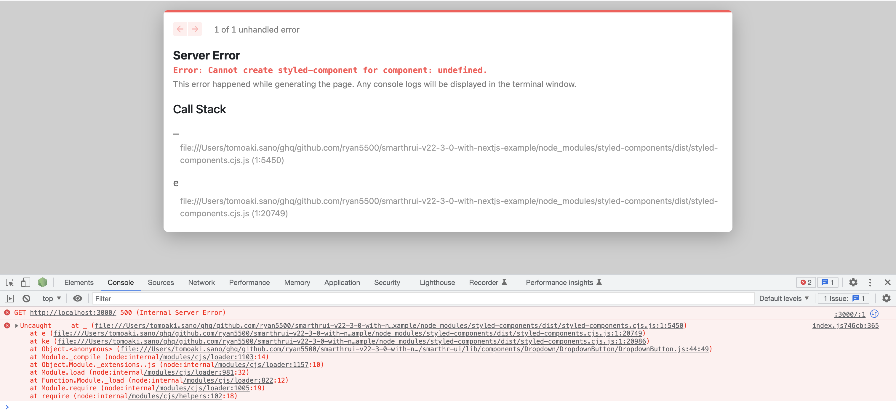

This is a minimal reproducible example project of SmartHR UI v21.3.0 occurs styled-component error with Next.js.

## How To Reproduce

```bash
yarn dev
```

* Open [http://localhost:3000](http://localhost:3000) with your browser.
* Open Developer Tools to see the result like below.


